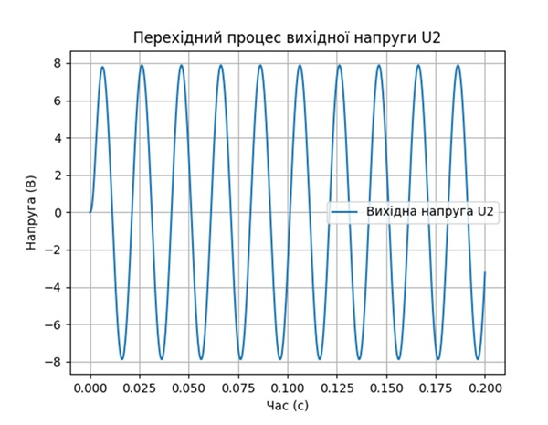

# **Lab 5: Numerical Solution of First-Order Differential Equations**  

## **Objective**  
The goal of this lab is to study basic methods for solving systems of first-order differential equations.  

---

## **Overview**  

### **Modified Euler Method**  
In the **Euler method**, the slope of the tangent line is assumed to be constant over the entire step size \( h \), leading to approximation errors.  

To improve accuracy, the **modified Euler method** (Euler's method with correction) computes an initial estimate using the standard Euler method and then refines it using the average slope at the start and end of the interval.  

---

## **Algorithm**  

1. **Initialize parameters:**  
   ```
   y0 = initial_value  
   t0 = initial_time  
   h = step_size  
   ```
2. **Iterate over time steps:**  
   ```
   for i = 0 to N:
       y_pred = y + h * f(t, y)  
       y = y + (h / 2) * (f(t, y) + f(t + h, y_pred))  
       t = t + h  
   ```
3. **Plot results:**  
   ```
   Generate transition process graph for output voltage U2  
   ```

---

## **Task 5: Solving RCL Circuit Equations**  

- **Method:** Modified Euler method  
- **Application:** Solving the transient response of an RCL circuit  
- **Output:** Graph of the transient response for output voltage \( U_2 \)  

---

## **Implementation**  

- **Programming Language:** Python  
- **Libraries:** NumPy, Matplotlib  

### **How to Run**  
1. Clone the repository:  
   ```bash
   git clone <repository-url>
   cd lab5
   ```  
2. Install dependencies:  
   ```bash
   pip install -r requirements.txt
   ```  
3. Run the program:  
   ```bash
   python lab5_euler.py
   ```  

---

## **Expected Results**  
- Numerical solution of the system of differential equations.  
- Visualization of the transient response of the circuit.  
## Графік перехідного процесу вихідної напруги U2  



---

## **References**  
1. Numerical Methods for Differential Equations.  
2. Modified Euler Method.  

