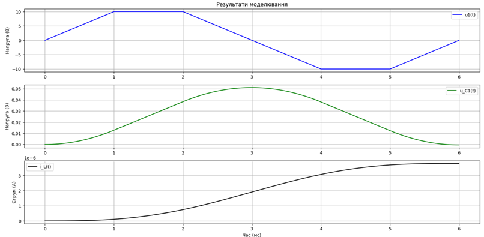
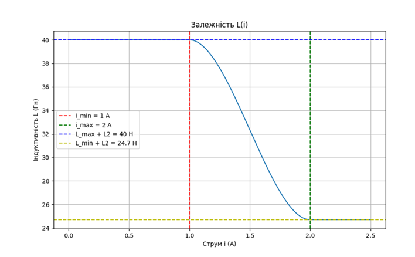

# **Lab 6: Dynamic Processes in Nonlinear Control System Elements**  

## **Objective**  
The goal of this lab is to investigate dynamic processes in nonlinear corrective elements of control systems using the fourth-order Runge-Kutta numerical method. The study includes approximating the inductance-current relationship, determining transient characteristics of currents and voltages in the circuit, solving state equations using Gaussian elimination, and analyzing the obtained results.  

---

## **Overview**  

### **Cauchy Problem**  
In engineering practice, many systems and processes evolve continuously over time. These processes are typically described by differential equations.  

A differential equation has an infinite number of solutions. To obtain a specific solution, additional conditions are required.  

- If conditions are specified at a single point, it is a **Cauchy problem** (initial value problem).  
- If conditions are given at two or more points, it is a **boundary value problem**.  

### **Runge-Kutta Methods**  
The Runge-Kutta methods are a family of iterative techniques for solving ordinary differential equations. The most commonly used version is the **fourth-order Runge-Kutta method**, which provides a good balance between accuracy and computational efficiency.  

---

## **Algorithm**  

1. **Initialize parameters:**  
   ```  
   Define circuit parameters: resistances, inductances, capacitance.  
   Set initial conditions for currents and voltages.  
   Define step size \( h \) and time interval.  
   ```  
2. **Apply Runge-Kutta Method (4th order):**  
   ```  
   for each time step t:
       Compute intermediate slopes k1, k2, k3, k4.  
       Update current and voltage values using weighted average of slopes.  
   ```  
3. **Solve the system using Gaussian elimination:**  
   ```  
   Convert equations into matrix form.  
   Apply Gaussian elimination with pivoting to solve the system.  
   ```  
4. **Plot results:**  
   ```  
   Generate transient response graphs for currents and voltages.  
   ```  

---

## **Task 6: Solving Nonlinear Circuit Equations**  

- **Method:** Runge-Kutta (4th order)  
- **Application:** Nonlinear inductance model in an RLC circuit  
- **Output:** Graphs of transient responses for currents and voltages  

---

## **Implementation**  

- **Programming Language:** Python  
- **Libraries:** NumPy, Matplotlib  

### **How to Run**  
1. Clone the repository:  
   ```bash
   git clone <repository-url>
   cd lab6
   ```  
2. Install dependencies:  
   ```bash
   pip install -r requirements.txt
   ```  
3. Run the program:  
   ```bash
   python lab6_runge_kutta.py
   ```  

---

## **Expected Results**  
- Numerical solution of the nonlinear system of differential equations.  
- Visualization of transient characteristics of the circuit.  


---

## **References**  
1. Numerical Methods for Differential Equations.  
2. Runge-Kutta Methods.  
3. Gaussian Elimination for Solving Linear Systems.  
